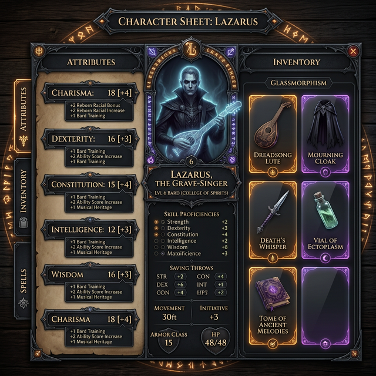

# UI Design Concept: Lazarus's Grave-Singer Menu

To create a truly immersive experience that feels like an RPG inventory, we'll combine **Dark Fantasy aesthetics** with **modern Glassmorphism**.

## Visual Concept

### Key Features:
1.  **Tabbed Navigation:**
    *   **Attributes:** Focus on stats, skills, and the breakdown of bonuses.
    *   **Inventory:** Grid-based item management (Dreadsong Lute, Mourning Cloak, etc.).
    *   **Concerto:** A dedicated tab for your *Creation Concerto* status (Nocturne/Requiem/Waltz).
2.  **Dynamic Calculations:**
    *   We won't just display `17`. We will display `17` and when you hover/click, it reveals:
        *   `Base: 15`
        *   `+2 (Reborn Racial Bonus)`
        *   `+1 (Special Item/Passive)`
3.  **Aesthetic Details:**
    *   **Glassmorphism:** Frosted glass panels over a dark, atmospheric background.
    *   **Arcane Accents:** Glowing purple/amber highlights for active abilities.
